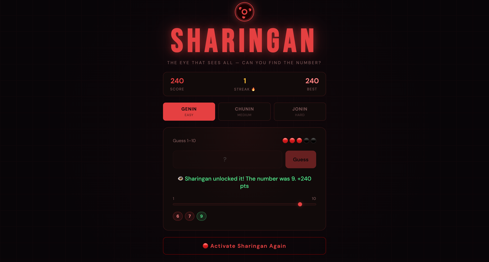

# 👁 Sharingan — Number Guessing Game

A browser-based number guessing game with a Naruto-inspired design. Guess the hidden number before your lives run out — the Sharingan sees all, but can you?

Built as part of my software engineering bootcamp journey, originally as a Node.js terminal game and later redesigned as a fully interactive browser experience.

---

## 🎮 Play It Live

Coming soon 

---

## 📸 Preview

 

---

## 🎨 Design Inspiration

The Sharingan is one of the most iconic abilities in Naruto — a legendary eye technique that **sees through deception and uncovers hidden truths**. When I was thinking of a name for a game about finding a hidden number, it felt like a perfect fit. The whole point of the Sharingan is to see what others can't — and that's exactly what the player is trying to do.

Once I had the name, I wanted the design to actually honour it rather than just borrow the reference. Every visual decision came from the Sharingan itself:

- **Deep black and red colour scheme** — the iconic colours of the eye
- **Spinning Sharingan SVG** with the three tomoe, hand-coded in SVG — the real design, not a placeholder icon
- **Red glow effects** on the title and interactive elements — giving it that activated, chakra-charged feel
- **🔴 and ⚫ lives display** — red tomoe for lives remaining, black for lost
- **Genin / Chunin / Jonin difficulty levels** — using the actual Naruto ninja ranks rather than just Easy/Medium/Hard, with the difficulty label underneath so non-fans aren't lost

It was also a deliberate contrast to my other project Nimbus (a weather app with a clean blue palette) — I wanted my portfolio to show range in both design and tone, not just technical skills.

---

## ✨ Features

- 👁 Spinning Sharingan eye SVG — hand-coded, no images or libraries
- 🎚️ Three difficulty levels — Genin (1–10), Chunin (1–50), Jonin (1–100)
- ❤️ Lives system — lose a life for every wrong guess
- 📊 Score and streak tracking across rounds
- 💡 Progressive hint system that activates after several wrong guesses:
  - Whether the number is odd or even
  - Which half of the range it's in
  - How close your last guess was
- 🎯 Visual range marker that slides to show where your last guess landed
- 🏷️ Colour coded guess chips — see all your previous guesses at a glance
- ⌨️ Enter key support
- 📱 Fully responsive — works on mobile and desktop

---

## 🛠️ Built With

- **HTML5**
- **CSS3** — custom animations, SVG styling, glow effects, responsive layout
- **Vanilla JavaScript** — game logic, DOM manipulation, event handling

---

## 🗂️ From Terminal to Browser

This game started life as a Node.js terminal app — a simple recursive game loop using `readline`. Rebuilding it as a browser game meant rethinking how the game loop works entirely, replacing `readline` with DOM events and replacing `console.log` with dynamic UI updates.

The core logic — `checkGuess()`, the hint system, scoring — stayed the same. But wrapping it in a visual interface taught me a lot about separating game logic from presentation, which is a principle that carries into bigger projects too.

---

## 💡 What I Learned

- How to **hand-code SVG** — the Sharingan eye is built entirely from SVG circles with no external assets
- CSS **animations and glow effects** to create atmosphere without any libraries
- Rebuilding a **terminal app as a browser experience** — understanding the difference between event-driven UI and a linear script
- **State management** in vanilla JS — tracking score, streak, lives and game state across rounds
- Designing with **intention** — making visual decisions that connect to the concept rather than just picking colours

---

## 🔮 Future Improvements

- [ ] Sound effects — kunai throw on wrong guess, victory music on win
- [ ] Mangekyou Sharingan unlock — special mode after a winning streak
- [ ] Multiplayer — challenge a friend to beat your score
- [ ] Leaderboard using local storage

---

## 👩🏾‍💻 Author

**Kemi Joan Willoughby**  
Business portfolio manager turned software engineer — and lifelong anime fan  
[GitHub](https://github.com/KJWsyntax) · [Portfolio](https://KJWsyntax.github.io)

---

## 📄 Licence

This project is open source and available under the [MIT Licence](https://opensource.org/licenses/MIT).